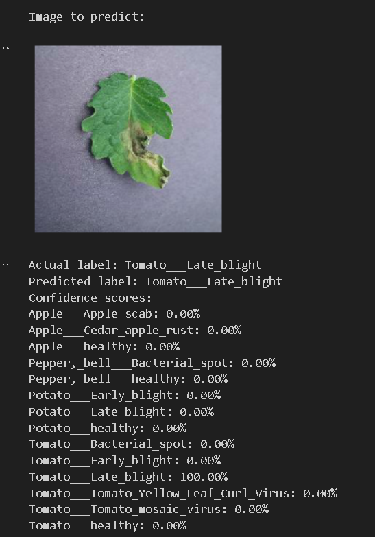

# 🌿 Plant Disease Detection Using Deep Learning

This project focuses on detecting plant diseases from leaf images using Convolutional Neural Networks (CNNs). It identifies diseases in **Apple**, **Pepper**, **Potato**, and **Tomato** crops. The model can help farmers take timely action to prevent crop loss.

---

## 🧠 Diseases Detected

The model classifies 14 categories:

### 🍏 Apple:
- Apple Scab
- Cedar Apple Rust
- Healthy

### 🌶️ Pepper (Bell):
- Bacterial Spot
- Healthy

### 🥔 Potato:
- Early Blight
- Late Blight
- Healthy

### 🍅 Tomato:
- Bacterial Spot
- Early Blight
- Late Blight
- Tomato Yellow Leaf Curl Virus
- Tomato Mosaic Virus
- Healthy

---

## 💻 Technologies Used
- Python
- Jupyter Notebook
- TensorFlow / Keras
- OpenCV
- NumPy, Pandas, Matplotlib
- Transfer Learning (optional depending on your code)

---

## 🚀 Project Highlights
- Dataset sourced from [PlantVillage Dataset](https://www.kaggle.com/datasets/emmarex/plantdisease).
- Implemented image preprocessing and data augmentation.
- Trained CNN models on multi-class classification.
- Achieved high accuracy and robust performance across categories.
- Visualized model performance with confusion matrix and accuracy/loss graphs.

---

## ✅ How to Run
1. Clone the repository  
2. Install dependencies using `pip install -r requirements.txt` (if applicable)  
3. Run the `PDD6.ipynb` notebook  
4. Upload any plant leaf image to test predictions

---

## 📷 Sample Output
Predicted labels and confidence scores are shown along with the uploaded image.

  

---

## 🙋‍♀️ Author
Created with 💙 by **Mahima Shukla**

---

